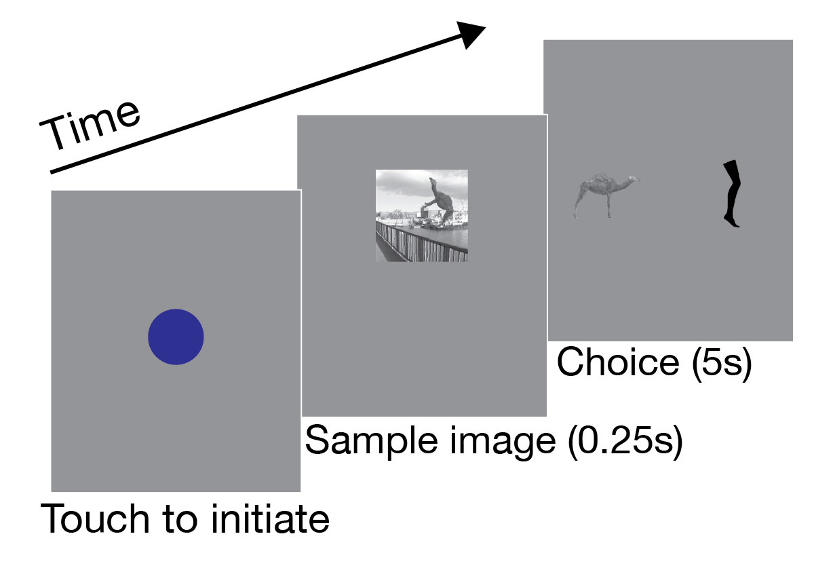

# kell-et-al-marmoset-benchmarking
This repository contains and describes data from work that benchmarks the high-level visual abilities of marmosets in comparison with humans, rhesus macaques, and rats. It also includes images used as stimuli for the comparisons, as well as images for animal training. It accompanies the <a href="https://doi.org/10.1101/2020.10.19.345561">preprint</a>:

<p align="center"> <b> <a href="https://doi.org/10.1101/2020.10.19.345561">Conserved core visual object recognition across simian primates: <br> Marmoset image-by-image behavior mirrors that of humans and macaques </a> </b></p>

<p align="center"> <a href="http://www.alexkell.org">Alexander J.E. Kell</a>, Sophie L. Bokor, You-Nah Jeon, Tahereh Toosi, <a href="https://zuckermaninstitute.columbia.edu/elias-b-issa-phd">Elias B. Issa</a></p>

The data and images can be downloaded <a href="https://drive.google.com/drive/folders/1k0hgEkWI5vO6jWRk4QklyMYsw1oMnwhm">here</a>. 

The structure of the data and image directories is briefly described below. For further questions, please email: first.last@columbia.edu (where first and last are "alex" and "kell").

<br/>

## Images and data for benchmarking marmoset with macaques and humans 

*Images originally employed in <a href="https://www.jneurosci.org/content/38/33/7255.short">Rajalingham et al., 2018</a>.*

      

### Images
Images are in the directory `images-marmosetMacaqueHuman`, with a subdirectory for each of the four objects (wrench, rhino, camel, leg). The 400 images on which we compared marmosets with macaques and humans are in the `evaluation` subdirectory (e.g., `images-marmosetMacaqueHuman/wrench/evaluation`). Also included are the images used for animal training (`token`, `training-low-variation`, and `training-high-variation`). The images used in the decision stage of the task (i.e., the ones subjects touch to indicate their choice) are these `token` images.



### Data
The data are pickled in Python. To load:

```python
import pickle

tmp = pickle.load(open('marmoset_macaque_and_human.pkl','rb'))
arr_n_trials, arr_n_correct, all_fnames = tmp['arr_n_trials'], tmp['arr_n_correct'], tmp['all_fns']
```

<br/>

`all_fnames` is a dictionary where each key is an object and each value is a list of the image filenames, in the order that they are indexed in the data arrays below. I.e.,

```python
[(k,len(all_fnames[k])) for k in all_fnames.keys()] == [('camel', 100), ('leg', 100), ('wrench', 100), ('rhino', 100)]

all_fnames['camel'][0] == 'objectome_camel_01914fb75f1180b0b1d98adc04c617caa2f387d1_ty0.039663_tz0.32309_rxy-64.131_rxz-62.8524_ryz8.6478_s1.0404.png'
```

<br/>

`arr_n_trials` and `arr_n_correct` are dictionaries with values that are numpy arrays of, respectively, the number of trials and number of correct trials. The keys correspond to which dataset and are as follows: 
```python
['human_sr2', 'marmoset_sr2_22dva', 'marmoset_sr2_11dva', 'marmoset_sr2_pooledOverSize', 'macaque_mts24_from_rajalinghamEtAl']
```

"dva" denotes degrees of visual angle and `marmoset_sr2_pooledOverSize` is simply the sum of the data from two different image sizes `marmoset_sr2_22dva` and `marmoset_sr2_11dva`.

The data is arranged in a 5d array, and axes are as follows: (`subjects`, `days`, `target_object`, `distractor_object`, `image_index`). E.g.,
```python
arr_n_trials['marmoset_sr2_22dva'].shape == (5, 42, 4, 4, 100)
```

The data for `marmoset_sr2_pooledOverSize` and `macaque_mts24_from_rajalinghamEtAl` are pooled over subjects. Objects are in the order: `['camel', 'rhino', 'leg', 'wrench']`.

<br/>

## Images and data for benchmarking marmoset with rats

*Images originally employed in <a href="https://www.pnas.org/content/106/21/8748">Zoccolan et al., 2009</a>.*

  

### Images 
Images are in subdirectories for each of the two stimuli `one-blob` and `two-blob`. The original 14 training images for each object are in the `original-training` subdirectory; all 54 images are in the `all-images` subdirectory.


### Data
To load:

```python
tmp = pickle.load(open('marmoset_and_rat.pkl','rb'))
```

The variable `tmp` is simply a dictionary with the matrices of rat and marmoset data as plotted in Figure 3 in Kell et al.: `rat_proportion_correct` and `marmoset_proportion_correct`. 
